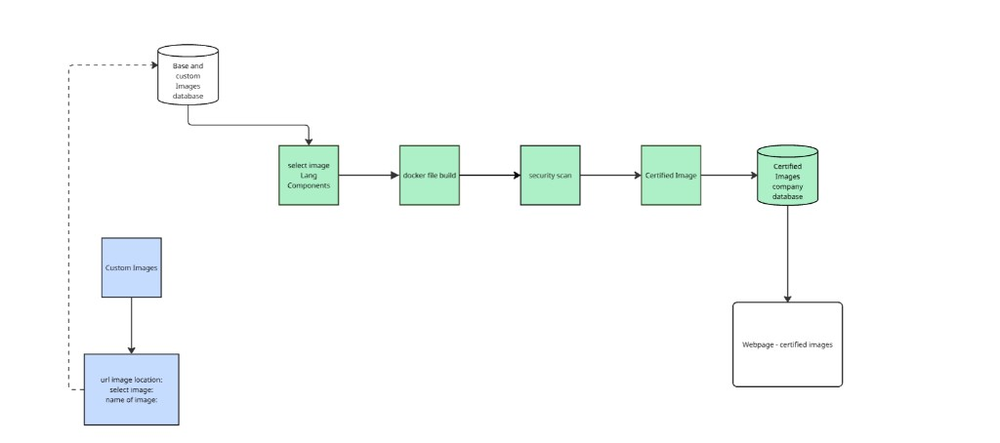
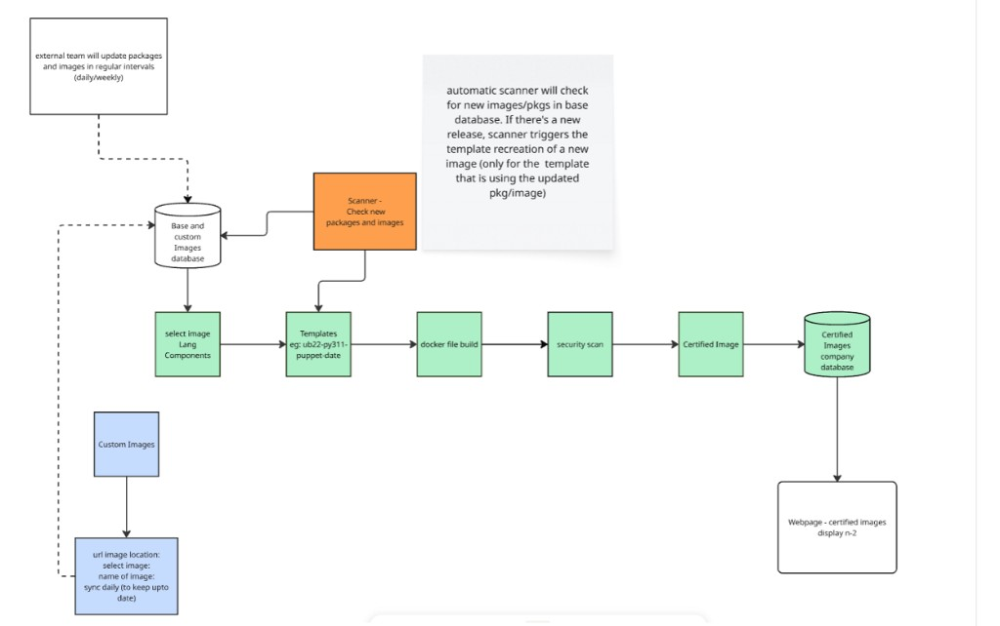

# ImageGuard

**Self-hosted container image factory** — select a base OS, language runtime, and components in a web UI; generate a Dockerfile; build the image; run a Trivy security scan; and promote certified images to a private registry for your teams.

Inspired by platforms like [Chainguard](https://www.chainguard.dev/), ImageGuard keeps the full pipeline under your control on your own infrastructure.

---

## What problem it solves

| Challenge | With ImageGuard |
|---|---|
| Every team rebuilds base + runtime + agents from scratch | Shared build flow from approved bases |
| Unknown images pulled from public registries | Private base (`:5050`) and certified (`:5051`) registries |
| Security checked too late | Trivy scan integrated into the build workflow |
| Hard to browse what is approved | Web dashboard + registry browser UI |

---

## Platform today (working end-to-end)

### Dual private registries

| Registry | Port | Role |
|---|---|---|
| Base OS / vendor images | `5050` | Foundation images (Ubuntu, Alpine, Red Hat UBI, custom imports) |
| Certified images | `5051` | Built images promoted from the dashboard |
| Registry browser UI | `8082` | Browse tags and digests for the certified registry |
| Web dashboard | `5000` | Build, scan, sync, and browse |

Images are stored on disk under `local-registry/*/data/` (Docker Registry v2 layout: `repositories/` + `blobs/`).

### Web dashboard (`localhost:5000`)

- **Dashboard** — browse certified images from `:5051`
- **Build** — pick base OS, optional runtime (Python / Java / Node / Go), and components (Prometheus, Puppet, Vault, logging); generate Dockerfile; build with Docker; run Trivy; sync a selected image to `:5051`
- **Custom** — pull vendor images from Docker Hub into the base registry (`:5050`)
- **Base Images** — list what is available in `:5050`
- **About** — product overview

### Build → scan → certify flow

```text
Base registry :5050
        │
        ▼
  Build page (select OS + runtime + components)
        │
        ▼
  Dockerfile generated → docker build
        │
        ▼
  Trivy security scan (results in UI)
        │
        ▼
  Sync button → Certified registry :5051
        │
        ▼
  Dashboard / apps / CI pull FROM localhost:5051/...
```

### Tech stack

- **Python / Flask** — dashboard and APIs ([web/app.py](web/app.py))
- **Docker SDK** — image build and push
- **Trivy** — vulnerability scanning
- **Docker Registry (`registry:2`)** — local registries on `:5050` and `:5051`
- **Joxit Registry UI** — certified registry browser on `:8082`

---

## Architecture (current)

Same flow as enterprise, without the automatic scanner — select, build, scan, and sync by hand.



In today’s build, templates are chosen/named on the Build page; promotion to the certified registry is done with the **Sync** button after the scan.

---

## Project structure

```text
ImageGuard/
├── README.md
├── requirements.txt
├── local-registry/
│   ├── base-os/          → localhost:5050
│   │   ├── start.sh
│   │   └── data/         (registry storage)
│   ├── certified/        → localhost:5051 + UI :8082
│   │   ├── start.sh
│   │   └── data/
│   └── README.md
└── web/
    ├── app.py            Flask app
    ├── start.sh
    └── templates/        Dashboard HTML
```

---

## Quick start

### 1. Base registry

```bash
cd local-registry/base-os
./start.sh
curl http://localhost:5050/v2/_catalog
```

### 2. Certified registry + UI

```bash
cd local-registry/certified
./start.sh
curl http://localhost:5051/v2/_catalog
# UI: http://localhost:8082
```

### 3. Web dashboard

```bash
./web/start.sh
# → http://localhost:5000
```

### 4. Typical use

1. Ensure base images exist in `:5050` (or import via **Custom**)
2. Open **Build**, choose base + runtime + components, start build
3. Review Trivy results on the build history row
4. Click **Sync** on that row to push to `:5051`
5. Pull in an app or pipeline:

```dockerfile
FROM localhost:5051/<image-name>:<tag>
```

---

## Service ports

| Service | Port |
|---|---|
| Flask dashboard | `5000` |
| Base registry | `5050` |
| Certified registry | `5051` |
| Certified registry UI | `8082` |

---

## Enterprise plan (automation)

The current platform is an interactive factory: teams build and certify through the UI.

The **enterprise direction** adds automation on top of the same registries so certified catalogs stay current when base images change — without rebuilding every combination by hand.

### Enterprise flow



### Planned capabilities

| Capability | Intent |
|---|---|
| **Template / recipe store (SQLite)** | One database of image families (e.g. `ub22_py311_puppet`) with dated versions such as `ub22_py311_puppet_2026-09-27` |
| **n / n-1 / n-2 retention** | Keep at most three versions per family; when a new build is certified, drop the oldest from the store and from `:5051` |
| **Auto scanner** | Poll the base registry for new tags/digests; when a base used by a recipe changes, create a new dated version and rebuild |
| **Scan gate** | Promote to the certified registry only when the scan meets policy |
| **Certified catalog UI** | Surfacing the three retained versions clearly for consuming teams |

Same idea as Chainguard-style catalogs: **approved, versioned images ready for `FROM`**, with automation to refresh them when foundations move.

---

## Example certified combinations

| Base OS | Runtime | Components | Example family |
|---|---|---|---|
| Ubuntu 22.04 | Python 3.11 | Prometheus | `ub22_py311_prometheus` |
| Alpine 3.19 | Python 3.11 | Prometheus | `alpine_py311_prometheus` |
| Ubuntu 22.04 | Java 17 | Puppet | `ub22_java17_puppet` |

---

## License / notes

Self-hosted demo / portfolio project. Registries and dashboard are designed to run locally with Docker.
