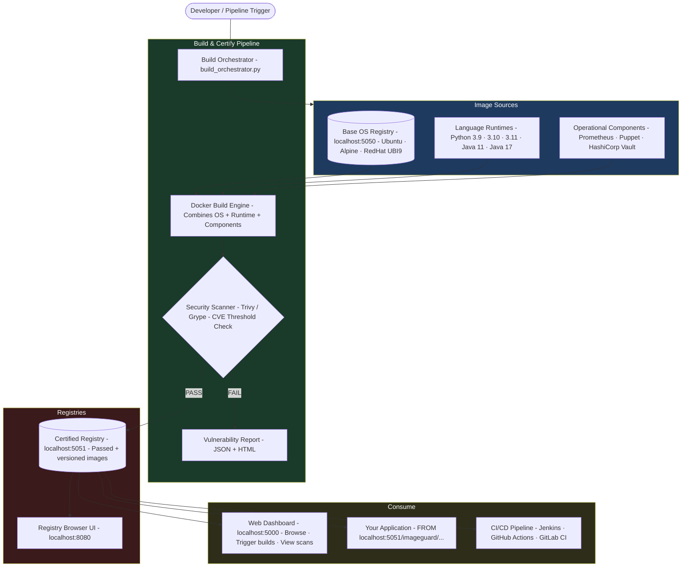

# ImageGuard

**A modular, automated container image factory — build, harden, scan, and serve pre-certified container images for your engineering teams.**

---

## What is ImageGuard?

Modern software teams waste significant time assembling container images from scratch for every project: find a base OS, install a language runtime, bolt on monitoring agents, then hope nothing is vulnerable. ImageGuard solves this by pre-building and pre-certifying a matrix of hardened images so teams can skip straight to shipping their application code.

ImageGuard works like [Chainguard](https://www.chainguard.dev/) but is **self-hosted and fully under your control**. You define the combinations, run the pipeline, and get a catalogue of certified images stored in your own private registry — ready to pull from CI/CD pipelines with a single `FROM` instruction.

---

## Why ImageGuard?

| Problem | Without ImageGuard | With ImageGuard |
|---|---|---|
| Image creation | Each team builds their own ad-hoc | One canonical build pipeline, every time |
| Security | Vulnerabilities discovered in production | Images scanned and rejected before they enter the registry |
| Consistency | OS/runtime versions drift across teams | Versioned, immutable images from a single source of truth |
| CI/CD onboarding | Teams configure Docker builds themselves | Drop-in `FROM localhost:5051/imageguard/<image>` |
| Compliance | Hard to prove what is in a running container | Full scan reports + image provenance |

---

## Architecture



---

## Project Structure

```
ImageGuard/
├── README.md                        ← You are here
├── implementation_plan.md           ← Detailed module specs
├── requirements.txt                 ← Python dependencies
│
├── image-repository/                ← Source image artefacts
│   ├── base-os/                     ← Base OS .tar images (Ubuntu, Alpine, RedHat)
│   ├── languages/                   ← Language runtime specs (Python, Java)
│   └── components/                  ← Component specs (Prometheus, Puppet, Vault)
│
├── local-registry/                  ← Private Docker registries
│   ├── base-os/                     ← Base image registry  → localhost:5050
│   │   ├── start.sh
│   │   └── data/                    ← Registry storage
│   ├── certified/                   ← Certified image registry → localhost:5051
│   │   ├── start.sh
│   │   └── data/                    ← Registry storage
│   └── docker-compose.yml           ← Alternative compose-based startup
│
└── web/                             ← Flask web dashboard → localhost:5000
    ├── app.py
    ├── start.sh
    └── templates/
```

---

## Components

### Registry: Base OS Images — `localhost:5050`

Stores the raw, unmodified base operating system images. These are the foundation layer for every image built by ImageGuard.

| Image | Version | Size |
|---|---|---|
| Ubuntu LTS | 22.04, 20.04 | ~28–30 MB |
| Alpine Linux | 3.19 | ~7 MB |
| Red Hat UBI 9 Minimal | latest | ~100 MB |

```bash
# Start the base OS registry
cd local-registry/base-os
./start.sh

# Verify
curl http://localhost:5050/v2/_catalog
```

### Registry: Certified Images — `localhost:5051`

Stores only images that have **passed the security scan**. Every image here is versioned, scanned, and safe to consume.

Naming convention:
```
localhost:5051/imageguard/<os>-<runtime>-<components>:<version>

Examples:
  localhost:5051/imageguard/ubuntu22-python311-prometheus:v1.0
  localhost:5051/imageguard/alpine-python311-prometheus:v1.0
  localhost:5051/imageguard/redhat-python311-prometheus:v1.2
```

```bash
# Start the certified registry + UI
cd local-registry/certified
./start.sh

# Verify
curl http://localhost:5051/v2/_catalog
```

### Registry UI — `localhost:8080`

A web browser for the certified registry. Browse available images, inspect tags, view content digests, and optionally delete images.

Open: [http://localhost:8080](http://localhost:8080)

### Web Dashboard — `localhost:5000`

A Flask web application for managing the platform:

- **Dashboard** — stats across all registries and recent builds
- **Image Catalog** — browse all available certified images with metadata
- **Build Interface** — configure and trigger new OS + runtime + component builds
- **Security** — view past vulnerability scan reports

```bash
cd /home/saneja/ImageGuard
./web/start.sh

# Or manually:
source venv/bin/activate
cd web && python app.py
```

Open: [http://localhost:5000](http://localhost:5000)

### Security Scanner

Before any image is promoted to the certified registry it passes through a vulnerability scanner (Trivy / Grype). The scanner checks all installed packages against known CVE databases and enforces a severity threshold:

- **PASS** → Image tagged, versioned, pushed to `:5051`
- **FAIL** → Build rejected, HTML + JSON report generated, image discarded

#### How Trivy Works

Trivy inspects the image filesystem layer by layer, extracts all installed packages (OS packages via `dpkg`/`rpm`/`apk`, Python `pip`, Java JARs, etc.), and matches them against its built-in CVE database (NVD, GitHub Advisory, RedHat, etc.).

**Key commands:**

```bash
# Scan an image — print results to terminal
trivy image localhost:5051/imageguard/ubuntu22-python311-prometheus:v1.0

# Fail the build if any CRITICAL or HIGH CVEs are found
trivy image --exit-code 1 --severity CRITICAL,HIGH <image>

# Export a full JSON report
trivy image --format json --output report.json <image>

# Export an HTML report
trivy image --format template --template "@contrib/html.tpl" --output report.html <image>

# Update the vulnerability database before scanning
trivy image --download-db-only
```

Trivy returns exit code `0` (pass) or `1` (fail), which the pipeline uses to decide whether to push the image to `:5051` or discard it.

---

## Quick Start

### 1. Start the Base OS Registry

```bash
cd /home/saneja/ImageGuard/local-registry/base-os
./start.sh
# → Registry available at localhost:5050
```

### 2. Start the Certified Registry + UI

```bash
cd /home/saneja/ImageGuard/local-registry/certified
./start.sh
# → Registry available at localhost:5051
# → Browser UI at localhost:8080
```

### 3. Start the Web Dashboard

```bash
cd /home/saneja/ImageGuard
./web/start.sh
# → Dashboard at localhost:5000
```

### 4. Verify Everything is Running

```bash
# Check registries
curl http://localhost:5050/v2/_catalog   # base OS images
curl http://localhost:5051/v2/_catalog   # certified images

# Check running containers
docker ps --filter "name=imageguard"
```

### 5. Pull a Certified Image in Your Application

```dockerfile
# In your application's Dockerfile
FROM localhost:5051/imageguard/ubuntu22-python311-prometheus:v1.0

WORKDIR /app
COPY . .
RUN pip install -r requirements.txt
CMD ["python", "main.py"]
```

---

## CI/CD Integration

ImageGuard plugs into any pipeline. Instead of building from scratch, reference a pre-certified image:

**Jenkinsfile example:**
```groovy
pipeline {
    agent any
    stages {
        stage('Build Application Image') {
            steps {
                sh '''
                    docker build \
                      --build-arg BASE=localhost:5051/imageguard/ubuntu22-python311-prometheus:v1.0 \
                      -t myapp:${BUILD_NUMBER} .
                '''
            }
        }
    }
}
```

**GitHub Actions example:**
```yaml
- name: Build with ImageGuard base
  run: |
    docker build \
      --build-arg BASE=localhost:5051/imageguard/alpine-python311-prometheus:v1.0 \
      -t myapp:${{ github.sha }} .
```

---

## Available Image Combinations

| Base OS | Runtime | Components | Registry Tag |
|---|---|---|---|
| Ubuntu 22.04 | Python 3.11 | Prometheus | `ubuntu22-python311-prometheus` |
| Alpine 3.19 | Python 3.11 | Prometheus | `alpine-python311-prometheus` |
| Red Hat UBI9 | Python 3.11 | Prometheus | `redhat-python311-prometheus` |
| Ubuntu 22.04 | Java 17 | Puppet | `ubuntu22-java17-puppet` |
| Alpine 3.19 | Java 11 | — | `alpine-java11` |

---

## Service Summary

| Service | Port | Purpose |
|---|---|---|
| Base OS Registry | `5050` | Raw base OS images (Ubuntu, Alpine, RedHat) |
| Certified Registry | `5051` | Security-scanned, production-ready images |
| Registry Browser UI | `8080` | Web UI to browse the certified registry |
| Web Dashboard | `5000` | Build, browse, and monitor via Flask UI |

---

## Roadmap

- [x] Base OS images downloaded and stored
- [x] Local registries running (base `:5050`, certified `:5051`)
- [x] Web dashboard
- [ ] `base_image_manager.py` — automated base image lifecycle
- [ ] `runtime_builder.py` — layered runtime image construction
- [ ] `component_installer.py` — plugin-based component installation
- [ ] `security_scanner.py` — Trivy integration with configurable thresholds
- [ ] `build_orchestrator.py` — matrix build engine (parallel builds)
- [ ] CI/CD pipeline templates (Jenkins, GitHub Actions, GitLab CI)
- [ ] CLI: `imageguard build --config matrix.yaml`
